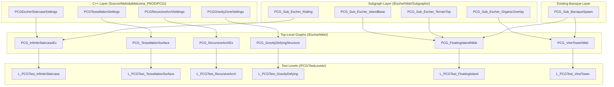

# Design Document: PCG Escher-Nikki Library

## Overview

This document describes the technical design for extending Melodia's PCG library with the
Escher-Nikki tier: four C++ custom PCG element classes, six top-level EscherNikki graphs,
four reusable subgraphs, a mesh catalog extension, a Python builder script, and six test
levels. The Escher-Nikki tier adds impossible-geometry primitives (infinite staircases,
recursive arches, gravity-defying structures, zero-gap tessellations) and Infinity Nikki
floating-island / vine-tower archetypes to the existing 18 baroque graphs and 5 Escher-tagged
vanilla graphs already in the project.

All new C++ classes live in `Source/MelodiaMelusina_PROD/PCG/`, all new graph assets live
under `/Game/_PROJECT/PCG/Graphs/EscherNikki/`, and the Python builder at
`Scripts/PCG/escher_nikki_builder.py` mirrors the exact structure of the existing
`melodia_pcgex_builder.py`.

---

## 1. Architecture Overview



**Dependency order for builder script:** Subgraphs must be created before top-level graphs
that reference them. Creation order: `PCG_Sub_Escher_*` (4) → top-level graphs (6).

---

## 2. C++ Class Design

### 2.1 Build.cs Diff

```csharp
// MelodiaMelusina_PROD.Build.cs — BEFORE
PublicDependencyModuleNames.AddRange(new string[] {
    "Core", "CoreUObject", "Engine", "InputCore", "AudioMixer", "UMG"
});

// AFTER — add three modules
PublicDependencyModuleNames.AddRange(new string[] {
    "Core", "CoreUObject", "Engine", "InputCore", "AudioMixer", "UMG",
    "PCG",                  // UPCGSettings, FPCGElement, FPCGContext
    "PCGEx",                // PCGExResamplePath et al. (guarded by #if WITH_PCGEX)
    "GeometryScripting"     // FGeometryScriptMeshBooleans if needed in future
});
```

The `PCGEx` entry is safe even when PCGExtendedToolkit is disabled at the plugin level
because all PCGEx headers are wrapped in `#if WITH_PCGEX` guards (see §2.4).

### 2.2 Class Hierarchy

```
FPCGElement  (Engine/PCG)
├── FPCGEscherStaircaseElement
├── FPCGGravityZoneElement
├── FPCGRecursiveArchElement
└── FPCGTessellationElement

UPCGSettings  (Engine/PCG)
├── UPCGEscherStaircaseSettings    ← UCLASS, owns FPCGEscherStaircaseElement
├── UPCGGravityZoneSettings        ← UCLASS, owns FPCGGravityZoneElement
├── UPCGRecursiveArchSettings      ← UCLASS, owns FPCGRecursiveArchElement
└── UPCGTessellationSettings       ← UCLASS, owns FPCGTessellationElement
```

Each `UPCGSettings` subclass implements `GetTypeId()`, `GetDefaultNodeTitle()`,
`GetDefaultNodeTitleColor()`, and `CreateElement()` — the minimal interface required to
appear in the PCG node palette and to instantiate the paired `FPCGElement`.

### 2.3 Header Sketches

#### PCGEscherStaircaseSettings.h

```cpp
// Source/MelodiaMelusina_PROD/PCG/PCGEscherStaircaseSettings.h
#pragma once
#include "PCGSettings.h"
#include "PCGEscherStaircaseSettings.generated.h"

DECLARE_CYCLE_STAT_EXTERN(TEXT("PCGEscherElement"), STAT_PCGEscherElement,
                          STATGROUP_PCG, MELODIAMELUSINA_PROD_API);

UCLASS(BlueprintType, ClassGroup=(Custom),
       meta=(BlueprintSpawnableComponent))
class MELODIAMELUSINA_PROD_API UPCGEscherStaircaseSettings : public UPCGSettings
{
    GENERATED_BODY()
public:
    UPROPERTY(EditAnywhere, BlueprintReadWrite, Category="Escher|Staircase",
              meta=(DisplayName="Step Count", ClampMin=3, ClampMax=256))
    int32 StepCount = 16;

    UPROPERTY(EditAnywhere, BlueprintReadWrite, Category="Escher|Staircase",
              meta=(DisplayName="Step Height (cm)", ClampMin=1.f))
    float StepHeight = 25.f;

    UPROPERTY(EditAnywhere, BlueprintReadWrite, Category="Escher|Staircase",
              meta=(DisplayName="Step Width (cm)", ClampMin=10.f))
    float StepWidth = 150.f;

    UPROPERTY(EditAnywhere, BlueprintReadWrite, Category="Escher|Staircase",
              meta=(DisplayName="Loop Radius (cm)", ClampMin=10.f))
    float LoopRadius = 600.f;

    UPROPERTY(EditAnywhere, BlueprintReadWrite, Category="Escher|Staircase",
              meta=(DisplayName="Seed"))
    int32 Seed = 0;

    virtual FPCGElementPtr CreateElement() const override;
    // ... GetTypeId, GetDefaultNodeTitle overrides
};
```

#### PCGGravityZoneSettings.h

```cpp
// Source/MelodiaMelusina_PROD/PCG/PCGGravityZoneSettings.h
#pragma once
#include "PCGSettings.h"
#include "PCGGravityZoneSettings.generated.h"

UCLASS(BlueprintType, ClassGroup=(Custom))
class MELODIAMELUSINA_PROD_API UPCGGravityZoneSettings : public UPCGSettings
{
    GENERATED_BODY()
public:
    UPROPERTY(EditAnywhere, BlueprintReadWrite, Category="Escher|GravityZone",
              meta=(DisplayName="Gravity Direction"))
    FVector GravityDir = FVector(0.f, 0.f, -1.f);

    virtual FPCGElementPtr CreateElement() const override;
};
```

#### PCGRecursiveArchSettings.h

```cpp
// Source/MelodiaMelusina_PROD/PCG/PCGRecursiveArchSettings.h
#pragma once
#include "PCGSettings.h"
#include "PCGRecursiveArchSettings.generated.h"

UCLASS(BlueprintType, ClassGroup=(Custom))
class MELODIAMELUSINA_PROD_API UPCGRecursiveArchSettings : public UPCGSettings
{
    GENERATED_BODY()
public:
    UPROPERTY(EditAnywhere, BlueprintReadWrite, Category="Escher|Arch",
              meta=(DisplayName="Arch Width (cm)", ClampMin=50.f))
    float ArchWidth = 400.f;

    UPROPERTY(EditAnywhere, BlueprintReadWrite, Category="Escher|Arch",
              meta=(DisplayName="Arch Height (cm)", ClampMin=50.f))
    float ArchHeight = 600.f;

    UPROPERTY(EditAnywhere, BlueprintReadWrite, Category="Escher|Arch",
              meta=(DisplayName="Recursion Depth", ClampMin=1, ClampMax=4))
    int32 RecursionDepth = 2;

    UPROPERTY(EditAnywhere, BlueprintReadWrite, Category="Escher|Arch",
              meta=(DisplayName="Scale Factor", ClampMin=0.3f, ClampMax=1.f))
    float ScaleFactor = 0.618f;

    virtual FPCGElementPtr CreateElement() const override;
};
```

#### PCGTessellationSettings.h

```cpp
// Source/MelodiaMelusina_PROD/PCG/PCGTessellationSettings.h
#pragma once
#include "PCGSettings.h"
#include "PCGTessellationSettings.generated.h"

UENUM(BlueprintType)
enum class EPCGTileShape : uint8
{
    Square   UMETA(DisplayName="Square"),
    Hexagon  UMETA(DisplayName="Hexagon"),
    Penrose  UMETA(DisplayName="Penrose")
};

UCLASS(BlueprintType, ClassGroup=(Custom))
class MELODIAMELUSINA_PROD_API UPCGTessellationSettings : public UPCGSettings
{
    GENERATED_BODY()
public:
    UPROPERTY(EditAnywhere, BlueprintReadWrite, Category="Escher|Tessellation",
              meta=(DisplayName="Tile Shape"))
    EPCGTileShape TileShape = EPCGTileShape::Square;

    UPROPERTY(EditAnywhere, BlueprintReadWrite, Category="Escher|Tessellation",
              meta=(DisplayName="Tile Scale (cm)", ClampMin=1.f))
    float TileScale = 200.f;

    virtual FPCGElementPtr CreateElement() const override;
};
```

### 2.4 Execute() Implementation Contracts

Each `FPCGElement::Execute()` follows these rules:

| Class | Key algorithm | Output pin | 16 ms budget |
|---|---|---|---|
| `FPCGEscherStaircaseElement` | Distribute N points on helix (radius R, angular step = 2π/N, Z step = StepHeight). Project final point Z back to Z=0 and XY to first point. | `"Out"` (point set) | Yes — O(N), N ≤ 512 |
| `FPCGGravityZoneElement` | Copy all input points; write `GravityDir` FVector attribute to each. | `"Out"` (point set) | Yes — O(N) |
| `FPCGRecursiveArchElement` | For depth 0..RecursionDepth-1: compute arch semi-circle points at width = ArchWidth × ScaleFactor^d. Emit separate tagged data per tier. | `"Out_Tier0"` .. `"Out_TierN"` (one per tier) | Yes — O(N×D), D ≤ 4 |
| `FPCGTessellationElement` | For Square/Hex: compute grid positions covering input AABB. For Penrose: P2 deflation to desired density. Write TileType(int32) per point. | `"Out"` (point set) | Yes — O(N²) surface area |

**Thread safety invariant:** `Execute()` receives a `FPCGContext*` that owns the output
`FPCGTaggedData` array. No static mutable state, no shared globals. All temporaries are
stack-local or allocated through the context's memory allocator.

**Parameter clamping pattern (identical for all four classes):**

```cpp
// In Execute() preamble — example for StepCount
if (Settings->StepCount < 3)
{
    UE_LOG(LogPCG, Warning,
           TEXT("PCGEscherStaircaseElement: StepCount %d < 3, clamped to 3"),
           Settings->StepCount);
    StepCount = 3;
}
```

### 2.5 PCGEx Guard Pattern

```cpp
// In any .cpp that uses PCGEx types:
#if WITH_PCGEX
#include "PCGExResamplePath.h"
#include "PCGExOrient.h"
// ...
#endif

#if WITH_EDITOR
#include "DetailLayoutBuilder.h"
// editor-only detail customization includes
#endif
```

---

## 3. PCG Graph Node Topology

Each graph uses the convention: X coordinates increase left-to-right in 300-unit steps.
`add_node_or_fallback(graph, "PCGEx*Settings", "PCGFallback*Settings", x, y)` is used for
all PCGEx nodes so graphs degrade gracefully when PCGEx is absent.

### 3.1 PCG_InfiniteStaircaseEx

```
Input(0,0)
  → PCGEscherStaircaseSettings(300,0)   [custom element: outputs Staircase_Loop points]
  → PCGExResamplePathSettings(600,0)    [fallback: PCGTransformPointsSettings]
      Distance = StepWidth (150 cm default)
  → PCGExOrientSettings(900,0)          [fallback: PCGTransformPointsSettings]
      AlignToPath = true
  → PCGWriteAttributesSettings(1200,0)  [write ArchitecturalRole="Stair", Walkable=true, Seed]
  → PCGSubgraphSettings(1500,0)         [PCG_Sub_Escher_Railing, enabled if RailingEnabled=true]
  → PCGStaticMeshSpawnerSettings(1800,0) [StepMeshCollection]
  → Output(2100,0)
```

**Blueprint parameters wired via PCGGraphInputOutputSettings:**
`StepCount`, `StepMeshCollection`, `RailingEnabled`, `Seed`, `MaterialOverride`

**Conditional branch for RailingEnabled:**
A `PCGBranchSettings` node at (1400, 100) gates the Railing subgraph call.
When false, points flow directly from the orient node to the spawner.

### 3.2 PCG_TessellationSurface

```
Input(0,0)  [expects surface or volume]
  → PCGTessellationSettings(300,0)      [custom element: grid/hex/Penrose points + TileType attr]
  → PCGExFilterByAttributeSettings(600,0)  [fallback: PCGPointFilterSettings]
      filter on TileType for alternate collection routing
  → PCGWriteAttributesSettings(900,0)   [ArchitecturalRole="Floor", Walkable=true, Seed]
  → PCGStaticMeshSpawnerSettings(1200,0) [primary collection]
  → PCGStaticMeshSpawnerSettings(1500,0) [AlternateCollection, routed from filter "false" pin]
  → PCGExMergePointsSettings(1800,0)    [fallback: PCGMergeSettings]
  → Output(2100,0)
```

**Conditional rotation branch:**
When `RandomRotation` is true, a `PCGTransformPointsSettings` node at (1050, -100) applies
random yaw before the spawner.

### 3.3 PCG_RecursiveArchEx

```
Input(0,0)
  → PCGRecursiveArchSettings(300,0)     [custom element: emits Out_Tier0..Out_TierN]
  → PCGExCopyToPointsSettings(600,0)    [fallback: PCGCopyPointsSettings]
      copies arch template to tier points
  → PCGExTransformPointsSettings(900,0) [fallback: PCGTransformPointsSettings]
      applies ScaleFactor per tier via TileType attribute
  → PCGWriteAttributesSettings(1200,0)  [ArchitecturalRole="Arch", RecursionTier attr, Seed]
  → PCGStaticMeshSpawnerSettings(1500,0) [ArchCollection]
  → Output(1800,0)
```

Multi-output pins from `PCGRecursiveArchSettings` are merged by a
`PCGExMergePointsSettings(1700,-100)` before reaching Output.

### 3.4 PCG_GravityDefyingStructure

```
Input(0,0)
  → PCGVolumeSamplerSettings(200,0)     [unbounded=true, voxel 400×400×600]
  → PCGGravityZoneSettings(500,0)       [custom element: writes GravityDir attribute]
  → PCGExTransformPointsSettings(800,0) [apply GravityDir rotation to point transforms]
      fallback: PCGTransformPointsSettings
  → PCGExCreateShapesSettings(1100,0)   [generate StructureType geometry per GravityDir]
      fallback: PCGTransformPointsSettings
  → PCGWriteAttributesSettings(1400,0)  [ArchitecturalRole per StructureType, Seed]
  → PCGStaticMeshSpawnerSettings(1700,0) [ModuleCollection]
  → Output(2000,0)
```

### 3.5 PCG_FloatingIslandNikki

```
Input(0,0)  [center point + IslandRadius parameter]
  → PCGSubgraphSettings(300,0)          [PCG_Sub_Escher_IslandBase → RockBase points]
  → PCGSubgraphSettings(300,200)        [PCG_Sub_Escher_TerrainTop → TerrainTop points]
  → PCGSubgraphSettings(300,400)        [PCG_Sub_BaroqueSpawn (existing) → Crown points]
      gated by PCGBranchSettings on CrownEnabled
  → PCGExMergePointsSettings(700,0)     [merge all three layers]
      fallback: PCGMergeSettings
  → PCGWriteAttributesSettings(1000,0)  [LayerRole per input tag, Seed]
  → PCGExNoiseFilterSettings(1300,0)    [fallback: PCGPointFilterSettings]
      density-based reduction per layer
  → PCGStaticMeshSpawnerSettings(1600,0) [RockCollection / TerrainCollection / CrownCollection]
  → Output(1900,0)
```

### 3.6 PCG_VineTowerNikki

```
Input(0,0)
  → PCGVolumeSamplerSettings(200,0)     [TowerRadius × TowerHeight cylinder sample]
  → PCGExUberFilterSettings(500,0)      [fallback: PCGPointFilterSettings]
      split into baroque-tier and organic-tier streams by VineDensity threshold
  → [stream A] PCGStaticMeshSpawnerSettings(800,0)   [BaroqueCollection]
  → [stream B] PCGSubgraphSettings(800,200)           [PCG_Sub_Escher_OrganicOverlay, Density=VineDensity]
  → PCGWriteAttributesSettings(1100,0)  [ArchitecturalRole="Tower" / "Organic", Seed]
      applied separately before merge
  → PCGExMergePointsSettings(1400,0)    [fallback: PCGMergeSettings]
  → Output(1700,0)
```

---

## 4. Subgraph Contracts

All subgraphs live in `/Game/_PROJECT/PCG/Graphs/EscherNikki/Subgraphs/`.
Each exposes a `Seed` (int32, default 0) Blueprint_Parameter on its own input node.

### 4.1 PCG_Sub_Escher_Railing

| Pin | Direction | Type | Description |
|-----|-----------|------|-------------|
| `In` | Input | Point Set | Stair-tread points (ordered path) |
| `RailingCollection` | Parameter | Soft Object Ref | PCGCol_EscherNikki_Stairs or override |
| `Seed` | Parameter | int32 | Deterministic variation |
| `Out` | Output | Point Set | Spawned railing instances |

**Node chain:**
```
Input(0,0)
  → PCGExResamplePathSettings(300,0)    [Distance=400 cm, ModuleWidth]
  → PCGExOrientSettings(600,0)          [path-tangent orientation]
  → PCGStaticMeshSpawnerSettings(900,0) [RailingCollection]
  → Output(1200,0)
```

### 4.2 PCG_Sub_Escher_IslandBase

| Pin | Direction | Type | Description |
|-----|-----------|------|-------------|
| `In` | Input | Point (center) | Island center point |
| `IslandRadius` | Parameter | float | Radius in cm |
| `Seed` | Parameter | int32 | Deterministic variation |
| `Out` | Output | Point Set | Hemisphere underside points tagged LayerRole="RockBase" |

**Node chain:**
```
Input(0,0)
  → PCGVolumeSamplerSettings(300,0)     [sphere sample, IslandRadius, unbounded=true]
  → PCGExNoiseFilterSettings(600,0)     [filter to lower hemisphere Z < centerZ]
  → PCGTransformPointsSettings(900,0)   [noise-displace positions for organic silhouette]
  → PCGWriteAttributesSettings(1200,0)  [LayerRole="RockBase"]
  → Output(1500,0)
```

### 4.3 PCG_Sub_Escher_OrganicOverlay

| Pin | Direction | Type | Description |
|-----|-----------|------|-------------|
| `In` | Input | Point Set | Source architecture points |
| `Density` | Parameter | float (0–1) | Fraction of points that survive noise filter |
| `OrganicCollection` | Parameter | Soft Object Ref | PCGCol_EscherNikki_Organic |
| `Seed` | Parameter | int32 | Deterministic variation |
| `Out` | Output | Point Set | Spawned organic instances (vine/moss/petal) |

**Node chain:**
```
Input(0,0)
  → PCGExNoiseFilterSettings(300,0)     [fallback: PCGPointFilterSettings]
      threshold driven by Density param (0=reject all, 1=accept all)
  → PCGStaticMeshSpawnerSettings(600,0) [OrganicCollection]
  → Output(900,0)
```

### 4.4 PCG_Sub_Escher_TerrainTop

| Pin | Direction | Type | Description |
|-----|-----------|------|-------------|
| `In` | Input | Point (center) | Island center point |
| `IslandRadius` | Parameter | float | Radius in cm |
| `Seed` | Parameter | int32 | Deterministic variation |
| `Out` | Output | Point Set | Dome-surface points tagged LayerRole="TerrainTop" |

**Node chain:**
```
Input(0,0)
  → PCGSurfaceSamplerSettings(300,0)    [PCGEx fallback: PCGExSurfaceSamplerSettings]
      points_per_squared_meter = 0.01, unbounded=true
  → PCGExNoiseFilterSettings(600,0)     [filter to upper hemisphere Z >= centerZ]
  → PCGWriteAttributesSettings(900,0)   [LayerRole="TerrainTop"]
  → Output(1200,0)
```

---

## 5. Data Flow & Attribute Pipeline

### 5.1 Shared Attribute Vocabulary

Every EscherNikki graph writes these attributes before the final Output node using
`PCGWriteAttributesSettings` nodes:

| Attribute | Type | Default | Written by |
|-----------|------|---------|-----------|
| `ArchitecturalRole` | string | graph-specific (see table below) | All graphs |
| `Walkable` | bool | true for navigable surfaces | All graphs |
| `Seed` | int32 | from graph Seed parameter | All graphs |
| `GravityDir` | FVector | (0,0,-1) | GravityDefyingStructure only |
| `TileType` | int32 | 0 or 1 | TessellationSurface, Penrose mode |
| `RecursionTier` | int32 | 0=outermost | RecursiveArchEx |
| `LayerRole` | string | "RockBase"/"TerrainTop"/"Crown" | FloatingIslandNikki |

**ArchitecturalRole values per graph:**

| Graph | Value |
|-------|-------|
| `PCG_InfiniteStaircaseEx` | `"Stair"` |
| `PCG_TessellationSurface` | `"Floor"` |
| `PCG_RecursiveArchEx` | `"Arch"` |
| `PCG_GravityDefyingStructure` | `"Tower"` / `"Bridge"` / `"Platform"` / `"Cantilever"` (from StructureType enum) |
| `PCG_FloatingIslandNikki` | `"Island"` |
| `PCG_VineTowerNikki` (baroque tier) | `"Tower"` |
| `PCG_VineTowerNikki` (organic tier) | `"Organic"` |

### 5.2 Attribute Flow Through the DAG

```
[Custom Element Execute()]
      │
      │  emits FPCGTaggedData with initial point positions
      ▼
[PCGEx Transform/Orient nodes]
      │
      │  augment point transforms; attributes pass through unchanged
      ▼
[PCGWriteAttributesSettings]
      │
      │  SETS: ArchitecturalRole, Walkable, Seed (and any graph-specific attrs)
      ▼
[PCGStaticMeshSpawnerSettings]
      │
      │  reads attributes for mesh selection; passes all attributes downstream
      ▼
[PCG_Sub_WalkabilityCheck]  ← only on navigable-tagged graphs
      │
      │  validates Walkable=true points: step height ≤ 50 cm, path width ≥ 200 cm
      ▼
[Output node]
```

### 5.3 Merge Compatibility with Baroque Graphs

When an EscherNikki graph output is merged with a baroque `*Ex` graph output via
`PCGExMergePointsSettings`, both output sets carry `ArchitecturalRole` (string),
`Walkable` (bool), and `Seed` (int32). The PCGEx merge node performs a union — no type
conflicts exist because the baroque graphs already write the same attribute names with the
same types (per the cohesion document §3).

### 5.4 GravityDir Propagation

```
PCGGravityZoneSettings.Execute()
  writes GravityDir FVector attribute to every output point
        │
        ▼
PCGExTransformPointsSettings
  reads GravityDir attribute, rotates point local-up-axis to GravityDir direction
        │
        ▼
PCGStaticMeshSpawnerSettings
  spawns mesh with transform already oriented by GravityDir rotation
        │
        ▼ (optional downstream)
Blueprint post-process
  queries GravityDir attribute from spawned instances for gameplay systems
```

---

## 6. Mesh Catalog Schema Extension

### 6.1 JSON Diff

The `escher_nikki` key is added as a top-level sibling of `"collections"` and
`"module_grid_cm"`. It uses an identical per-collection structure. The builder script reads
from `catalog["escher_nikki"]`, never touching `catalog["collections"]`.

```json
{
  "version": "2026-06-15",
  "escher_nikki": {
    "PCGCol_EscherNikki_Stairs": {
      "tag": "stair",
      "entries": [
        {
          "mesh": "/Game/_PROJECT/MelusinasHouse/SM_SpiralStair001",
          "weight": 3,
          "tags": ["step", "spiral"]
        },
        {
          "mesh": "/Game/_PROJECT/houseassets/SM_placeholder_stair",
          "weight": 1,
          "tags": ["step"],
          "note": "replace with dedicated mesh"
        }
      ]
    },
    "PCGCol_EscherNikki_Tiles": {
      "tag": "tile",
      "entries": [
        {
          "mesh": "/Game/_PROJECT/houseassets/SM_ceilingsquare",
          "weight": 2,
          "tags": ["square", "flat"]
        },
        {
          "mesh": "/Game/_PROJECT/houseassets/SM_MarbleSlabOutline",
          "weight": 2,
          "tags": ["hex_placeholder"],
          "note": "replace with dedicated hexagonal tile mesh"
        },
        {
          "mesh": "/Game/_PROJECT/houseassets/SM_MarbleSlabOutline_007",
          "weight": 1,
          "tags": ["penrose_fat"],
          "note": "replace with Penrose fat rhombus mesh"
        }
      ]
    },
    "PCGCol_EscherNikki_Organic": {
      "tag": "organic",
      "entries": [
        {
          "mesh": "/Game/_PROJECT/MelusinasHouse/SM_wallhi",
          "weight": 1,
          "tags": ["vine_placeholder"],
          "note": "replace with dedicated vine/moss/petal meshes"
        }
      ]
    },
    "PCGCol_EscherNikki_IslandRocks": {
      "tag": "island_rock",
      "entries": [
        {
          "mesh": "/Game/_PROJECT/MelusinasHouse/SM_surrealtower1",
          "weight": 2,
          "tags": ["rock_base"],
          "note": "replace with dedicated floating-island rock underside mesh"
        },
        {
          "mesh": "/Game/_PROJECT/MelusinasHouse/SM_surrealtower2",
          "weight": 1,
          "tags": ["rock_base"],
          "note": "replace with dedicated floating-island rock underside mesh"
        }
      ]
    }
  }
}
```

### 6.2 Schema Rules

- `escher_nikki` collections must **never** duplicate a key in `collections` — if a mesh is
  reused from the baroque tier, it appears in `escher_nikki` with a different collection key
  and its own weighting context.
- All placeholder entries carry `"note": "replace with dedicated mesh"` so artists can
  search for `"note"` to find outstanding art deliverables.
- The builder's `configure_spawner_from_collection_escher()` helper reads from
  `catalog["escher_nikki"]` and uses the same `mesh_entry()` and warning pattern as the
  baroque version.

---

## 7. Python Builder Architecture

### 7.1 Module Structure

```
Scripts/PCG/escher_nikki_builder.py
│
├── Docstring (usage identical format to melodia_pcgex_builder.py)
├── Imports
│   ├── stdlib: json, os, importlib.util, dataclasses, typing
│   └── unreal  (must run in UE editor Python)
│
├── Helper import block
│   └── Loads melodia_pcgex_builder module by file path (importlib.util pattern)
│       Extracts: create_graph_asset, add_node, wire_chain,
│                 configure_spawner_from_collection, add_node_or_fallback,
│                 ensure_directory, save_and_reload, clear_user_nodes, mesh_entry
│
├── Constants
│   ├── CATALOG_PATH  (same PROJECT_ROOT pattern)
│   ├── GRAPH_PACKAGE   = "/Game/_PROJECT/PCG/Graphs/EscherNikki"
│   └── SUBGRAPH_PACKAGE = "/Game/_PROJECT/PCG/Graphs/EscherNikki/Subgraphs"
│
├── configure_spawner_from_collection_escher(spawner_settings, collection_key, catalog)
│   └── Reads from catalog["escher_nikki"][collection_key]
│
├── Subgraph builder functions (4)
│   ├── build_sub_escher_railing(catalog) → str
│   ├── build_sub_escher_island_base(catalog) → str
│   ├── build_sub_escher_organic_overlay(catalog) → str
│   └── build_sub_escher_terrain_top(catalog) → str
│
├── Top-level graph builder functions (6)
│   ├── build_infinite_staircase_ex(catalog, sub_railing_path) → str
│   ├── build_tessellation_surface(catalog) → str
│   ├── build_recursive_arch_ex(catalog) → str
│   ├── build_gravity_defying_structure(catalog) → str
│   ├── build_floating_island_nikki(catalog, sub_island_base_path,
│   │       sub_terrain_top_path, sub_organic_path) → str
│   └── build_vine_tower_nikki(catalog, sub_organic_path) → str
│
├── GRAPH_BUILDERS: dict[str, Callable[[dict], str]]  (populated in build_graph)
│
├── build_all(force_rebuild=False) → list[str]
│   ├── Assert PCGGraph available
│   ├── PCGEx availability check (warn + continue on failure)
│   ├── ensure_directory(SUBGRAPH_PACKAGE), ensure_directory(GRAPH_PACKAGE)
│   ├── Build subgraphs first (collect paths)
│   ├── Build top-level graphs (passing subgraph paths)
│   └── Return ordered list of all asset paths
│
└── build_graph(name: str) → str
    ├── Load catalog once
    ├── Build all subgraphs first (needed as dependencies)
    ├── Map name → lambda → call builder
    └── Raise KeyError for unknown names
```

### 7.2 Helper Import Pattern

```python
import importlib.util as _ilu
import os as _os

_BUILDER_PATH = _os.path.join(
    _os.path.dirname(_os.path.abspath(__file__)),
    "melodia_pcgex_builder.py"
)
_spec = _ilu.spec_from_file_location("melodia_pcgex_builder", _BUILDER_PATH)
_baroque = _ilu.module_from_spec(_spec)
_spec.loader.exec_module(_baroque)

# Extract shared helpers
create_graph_asset               = _baroque.create_graph_asset
add_node                         = _baroque.add_node
add_node_or_fallback             = _baroque.add_node_or_fallback
wire_chain                       = _baroque.wire_chain
configure_spawner_from_collection = _baroque.configure_spawner_from_collection
ensure_directory                 = _baroque.ensure_directory
save_and_reload                  = _baroque.save_and_reload
clear_user_nodes                 = _baroque.clear_user_nodes
mesh_entry                       = _baroque.mesh_entry
```

### 7.3 Dependency Order in build_all()

```python
def build_all(force_rebuild=False):
    catalog = load_catalog()
    ensure_directory(SUBGRAPH_PACKAGE)
    ensure_directory(GRAPH_PACKAGE)
    paths = []

    # Phase 1: Subgraphs (no inter-subgraph dependencies)
    sub_railing      = build_sub_escher_railing(catalog);      paths.append(sub_railing)
    sub_island_base  = build_sub_escher_island_base(catalog);  paths.append(sub_island_base)
    sub_organic      = build_sub_escher_organic_overlay(catalog); paths.append(sub_organic)
    sub_terrain_top  = build_sub_escher_terrain_top(catalog);  paths.append(sub_terrain_top)

    # Phase 2: Top-level graphs (reference subgraph paths)
    paths.append(build_infinite_staircase_ex(catalog, sub_railing))
    paths.append(build_tessellation_surface(catalog))
    paths.append(build_recursive_arch_ex(catalog))
    paths.append(build_gravity_defying_structure(catalog))
    paths.append(build_floating_island_nikki(catalog, sub_island_base,
                                             sub_terrain_top, sub_organic))
    paths.append(build_vine_tower_nikki(catalog, sub_organic))
    return paths  # 10 total: 4 subgraphs + 6 top-level
```

### 7.4 Round-Trip Consistency Guarantee

`build_graph(name)` reconstructs the same subgraph dependencies before building the
requested graph, so the returned path is identical to `build_all()[i]`. This is verified
by the property test in §10.

---

## 8. Monolith MCP Execution Plan

Monolith MCP runs at `http://localhost:9316/mcp`. Each deliverable maps to specific tool
calls. This section is the authoritative reference for the tasks phase.

### 8.1 C++ File Creation → Compile Verification

| Step | Tool | Arguments |
|------|------|-----------|
| 1. Write header files (4 × `.h`) | `fs_write` (direct file write) | `Source/MelodiaMelusina_PROD/PCG/PCGEscher*.h` |
| 2. Write implementation files (4 × `.cpp`) | `fs_write` | `Source/MelodiaMelusina_PROD/PCG/PCGEscher*.cpp` |
| 3. Update Build.cs | `str_replace` | Add `"PCG"`, `"PCGEx"`, `"GeometryScripting"` |
| 4. Trigger hot-reload compile | `editor.live_compile` | `{}` |
| 5. Verify zero errors | `editor.get_build_errors` | `{}` — assert result is empty |

If `editor.live_compile` is unavailable, fall back to `editor.trigger_build` then poll
`editor.get_build_errors` until result is empty or timeout (60 s).

### 8.2 Mesh Catalog Extension

| Step | Tool | Arguments |
|------|------|-----------|
| 1. Read current catalog | `read_file` | `Scripts/PCG/baroque_mesh_catalog.json` |
| 2. Write updated catalog | `fs_write` | Same path, JSON with `escher_nikki` key added |
| 3. Verify JSON validity | `execute_pwsh` | `python -c "import json; json.load(open('...'))"` |

### 8.3 Python Builder Script Creation

| Step | Tool | Arguments |
|------|------|-----------|
| 1. Write script | `fs_write` | `Scripts/PCG/escher_nikki_builder.py` |
| 2. Syntax check | `execute_pwsh` | `python -m py_compile Scripts/PCG/escher_nikki_builder.py` |

### 8.4 Subgraph Asset Creation (in-editor)

| Step | Tool | Arguments |
|------|------|-----------|
| 1. Run subgraph builders | `editor.run_python` | Script body: `escher_nikki_builder.build_sub_escher_railing(...)` × 4 |
| 2. Verify assets exist | `project.get_asset_info` | `/Game/_PROJECT/PCG/Graphs/EscherNikki/Subgraphs/PCG_Sub_Escher_*` |

Preferred: run `build_all()` once, which creates all 4 subgraphs then all 6 top-level graphs.

### 8.5 Top-Level Graph Asset Creation (in-editor)

| Step | Tool | Arguments |
|------|------|-----------|
| 1. Run full builder | `editor.run_python` | `import importlib.util; ... mod.build_all()` (same pattern as baroque builder usage) |
| 2. Verify each graph | `project.get_asset_info` | Query each of the 6 graph paths |
| 3. Check for PCG errors | `editor.run_python` | Short script to open/generate each graph and collect errors |

**Standard invocation pattern** (identical to baroque builder, per requirements):

```python
import importlib.util
spec = importlib.util.spec_from_file_location(
    "escher_nikki_builder",
    r"G:/Melodia/Scripts/PCG/escher_nikki_builder.py")
mod = importlib.util.module_from_spec(spec)
spec.loader.exec_module(mod)
mod.build_all()
```

### 8.6 Test Level Creation

| Step | Tool | Arguments |
|------|------|-----------|
| 1. Create empty map | `editor.create_empty_map` | `path="/Game/_PROJECT/PCG/TestLevels/L_PCGTest_<Name>"` |
| 2. Place PCG volume | `editor.run_python` | Script spawns `PCGComponent`, assigns graph, sets params |
| 3. Trigger generation | `editor.run_python` | `pcg_component.generate()` |
| 4. Verify instances | `editor.run_python` | Assert component output count > 0 |

Repeat for all 6 test levels. Parameters per level defined in Req 13 acceptance criteria.

### 8.7 Verification Pass

| Step | Tool | Arguments |
|------|------|-----------|
| Check compile errors | `editor.get_build_errors` | Assert empty |
| Check all graph assets exist | `project.get_asset_info` × 10 | All must return valid |
| Check test levels exist | `project.get_asset_info` × 6 | All must return valid |
| Round-trip check | `editor.run_python` | `build_graph(n) == build_all()[i]` for each graph |

---

## 9. File System Layout

Complete directory tree of all new files and directories to be created:

```
Melodia/
├── Source/
│   └── MelodiaMelusina_PROD/
│       ├── MelodiaMelusina_PROD.Build.cs          [MODIFIED — add PCG, PCGEx, GeometryScripting]
│       └── PCG/                                    [NEW DIRECTORY]
│           ├── PCGEscherStaircaseSettings.h        [NEW]
│           ├── PCGEscherStaircaseSettings.cpp      [NEW]
│           ├── PCGGravityZoneSettings.h            [NEW]
│           ├── PCGGravityZoneSettings.cpp          [NEW]
│           ├── PCGRecursiveArchSettings.h          [NEW]
│           ├── PCGRecursiveArchSettings.cpp        [NEW]
│           ├── PCGTessellationSettings.h           [NEW]
│           └── PCGTessellationSettings.cpp         [NEW]
│
└── Scripts/
    └── PCG/
        ├── baroque_mesh_catalog.json               [MODIFIED — add "escher_nikki" key]
        ├── melodia_pcgex_builder.py                [UNCHANGED — referenced by new builder]
        └── escher_nikki_builder.py                 [NEW]

UE Content (asset paths, not physical files):
/Game/_PROJECT/PCG/
├── Graphs/
│   └── EscherNikki/                               [NEW DIRECTORY]
│       ├── PCG_InfiniteStaircaseEx                [NEW graph asset]
│       ├── PCG_TessellationSurface                [NEW graph asset]
│       ├── PCG_RecursiveArchEx                    [NEW graph asset]
│       ├── PCG_GravityDefyingStructure            [NEW graph asset]
│       ├── PCG_FloatingIslandNikki                [NEW graph asset]
│       ├── PCG_VineTowerNikki                     [NEW graph asset]
│       └── Subgraphs/                             [NEW DIRECTORY]
│           ├── PCG_Sub_Escher_Railing             [NEW subgraph asset]
│           ├── PCG_Sub_Escher_IslandBase          [NEW subgraph asset]
│           ├── PCG_Sub_Escher_OrganicOverlay      [NEW subgraph asset]
│           └── PCG_Sub_Escher_TerrainTop          [NEW subgraph asset]
└── TestLevels/                                    [EXISTING — add 6 levels]
    ├── L_PCGTest_InfiniteStaircase                [NEW level asset]
    ├── L_PCGTest_TessellationSurface              [NEW level asset]
    ├── L_PCGTest_RecursiveArch                    [NEW level asset]
    ├── L_PCGTest_GravityDefying                   [NEW level asset]
    ├── L_PCGTest_FloatingIsland                   [NEW level asset]
    └── L_PCGTest_VineTower                        [NEW level asset]
```

**Total new files:**
- C++ headers: 4
- C++ sources: 4
- Build.cs: 1 (modified)
- Python scripts: 1 new, 1 modified
- UE graph assets: 10 (4 subgraphs + 6 top-level)
- UE level assets: 6

---

## Correctness Properties

*A property is a characteristic or behavior that should hold true across all valid executions of
a system — essentially, a formal statement about what the system should do. Properties serve as
the bridge between human-readable specifications and machine-verifiable correctness guarantees.*

### Property 1: Staircase Loop Closure

*For any* valid `StepCount` N (3 ≤ N ≤ 256), `StepHeight`, `StepWidth`, `LoopRadius`, and
`Seed`, the output point set from `PCGEscherStaircaseSettings.Execute()` shall have its Nth
point's XY position within 1 cm of its 0th point's XY position (loop closure tolerance).

**Validates: Requirements 1.3, 2.1**

### Property 2: Recursive Arch Tier Width Ratio

*For any* valid `ArchWidth`, `ArchHeight`, `RecursionDepth` D (1 ≤ D ≤ 4), and `ScaleFactor`
S (0.3 ≤ S ≤ 1.0), the bounding box width of tier i+1 divided by the bounding box width of
tier i shall equal S within 2% relative tolerance, for all adjacent tier pairs 0..(D-2).

**Validates: Requirements 1.5, 4.3**

### Property 3: Zero-Gap Tessellation

*For any* `TileShape` (Square or Hexagon) and `TileScale` T (1 ≤ T ≤ 10000), the maximum
distance between any two adjacent tile center points in the output of `PCGTessellationSettings`
shall not exceed `T × 1.05` cm, ensuring zero visible gaps between tiles.

**Validates: Requirements 1.6, 3.4**

### Property 4: GravityDir Attribute Presence

*For any* input point set of size N ≥ 1 and any `GravityDir` FVector, the output of
`PCGGravityZoneSettings.Execute()` shall contain exactly N points, each carrying a
`GravityDir` attribute whose value equals the input `GravityDir` vector within floating-point
epsilon.

**Validates: Requirements 1.4, 5.1, 5.5**

### Property 5: Penrose TileType Completeness

*For any* Penrose tessellation output, every point in the output point set shall have a
`TileType` attribute with value 0 (fat rhombus) or 1 (thin rhombus), and both values shall
appear at least once for any surface input with area ≥ 4 × TileScale².

**Validates: Requirements 1.6, 3.3**

### Property 6: Parameter Clamping Safety

*For any* out-of-range parameter value passed to any Custom_PCG_Element, the Execute() call
shall not crash or produce an empty output — it shall clamp the parameter and produce a
non-empty valid point set (or an empty set only for legitimately degenerate inputs after
clamping, e.g. StepCount=3 with degenerate geometry).

**Validates: Requirements 1.7**

### Property 7: ScaleFactor Floor Clamp

*For any* ScaleFactor value S < 0.3 passed to `PCGRecursiveArchSettings`, the tier width
ratio computed from the Execute() output shall equal the ratio corresponding to ScaleFactor
= 0.3, not S.

**Validates: Requirements 1.5, 4.6**

### Property 8: Builder Round-Trip Consistency

*For any* graph name N in the set of all EscherNikki graph names, calling
`build_graph(N)` in `escher_nikki_builder.py` shall return the same asset path string as the
corresponding element in the list returned by `build_all()`.

**Validates: Requirements 10.6**

### Property 9: VineDensity Extremes

*For any* tower configuration, when `VineDensity` = 0.0 the count of organic instances in the
output shall be 0; when `VineDensity` = 1.0 the count of organic instances shall be ≥ the
count of baroque wall module points in the output.

**Validates: Requirements 7.3, 7.4**

### Property 10: Shared Attribute Merge Compatibility

*For any* EscherNikki graph output merged with any baroque `*Ex` graph output via
`PCGExMergePointsSettings`, every point in the merged output shall have an `ArchitecturalRole`
attribute of type string and a `Walkable` attribute of type bool, with no type conflicts or
missing attribute errors.

**Validates: Requirements 14.1, 14.4**

---

## Architecture

See Section 1 (Architecture Overview) for the full component diagram showing C++ elements →
subgraphs → top-level graphs → test levels. See Section 2 (C++ Class Design) for the class
hierarchy and Build.cs changes.

**Summary of architectural layers:**
- **C++ Layer** — Four `UPCGSettings` + `FPCGElement` pairs in `Source/MelodiaMelusina_PROD/PCG/`
- **Subgraph Layer** — Four `PCG_Sub_Escher_*` reusable subgraphs in `/EscherNikki/Subgraphs/`
- **Graph Layer** — Six top-level `PCG_*Ex` / `PCG_*Nikki` graphs in `/EscherNikki/`
- **Test Layer** — Six `L_PCGTest_*` levels in `/PCG/TestLevels/`
- **Script Layer** — `escher_nikki_builder.py` orchestrating in-editor asset creation via Monolith MCP

---

## Components and Interfaces

See Section 2 (C++ Class Design) for full UCLASS/UPROPERTY interface definitions.
See Section 3 (PCG Graph Node Topology) for graph-level component interfaces.
See Section 4 (Subgraph Contracts) for subgraph pin specifications.

**Core component interfaces summary:**

| Component | Type | Key Interface |
|-----------|------|--------------|
| `UPCGEscherStaircaseSettings` | UPCGSettings subclass | `StepCount`, `StepHeight`, `StepWidth`, `LoopRadius`, `Seed` UPROPERTY; `CreateElement()` |
| `UPCGGravityZoneSettings` | UPCGSettings subclass | `GravityDir` UPROPERTY; `CreateElement()` |
| `UPCGRecursiveArchSettings` | UPCGSettings subclass | `ArchWidth`, `ArchHeight`, `RecursionDepth`, `ScaleFactor` UPROPERTY; `CreateElement()` |
| `UPCGTessellationSettings` | UPCGSettings subclass | `TileShape` (enum), `TileScale` UPROPERTY; `CreateElement()` |
| `PCG_Sub_Escher_Railing` | PCG Subgraph | Input: path points; Params: RailingCollection, Seed; Output: spawned railings |
| `PCG_Sub_Escher_IslandBase` | PCG Subgraph | Input: center point; Params: IslandRadius, Seed; Output: rock hemisphere cloud |
| `PCG_Sub_Escher_OrganicOverlay` | PCG Subgraph | Input: points; Params: Density (0-1), OrganicCollection, Seed; Output: organic instances |
| `PCG_Sub_Escher_TerrainTop` | PCG Subgraph | Input: center point; Params: IslandRadius, Seed; Output: dome surface cloud |
| `escher_nikki_builder.py` | Python module | `build_all() → list[str]`; `build_graph(name: str) → str` |

---

## Data Models

See Section 6 (Mesh Catalog Schema Extension) for the JSON data model diff.
See Section 5 (Data Flow & Attribute Pipeline) for the PCG point attribute data models.

**PCG Point Attribute Schema:**

| Attribute Name | Type | Description | Produced By |
|----------------|------|-------------|-------------|
| `ArchitecturalRole` | string | Semantic role: "Stair", "Floor", "Arch", "Tower", "Organic", "Island" | All EscherNikki graphs |
| `Walkable` | bool | Whether point is navigable (step ≤ 50 cm, width ≥ 200 cm) | All EscherNikki graphs |
| `Seed` | int32 | Seed value used to generate this point set | All EscherNikki graphs |
| `GravityDir` | FVector | Override gravity direction (default (0,0,-1)) | PCGGravityZoneSettings, PCG_GravityDefyingStructure |
| `TileType` | int32 | Penrose: 0=fat rhombus, 1=thin rhombus | PCGTessellationSettings (Penrose mode) |
| `RecursionTier` | int32 | Arch tier index, 0=outermost | PCGRecursiveArchSettings, PCG_RecursiveArchEx |
| `LayerRole` | string | Island layer: "RockBase", "TerrainTop", "Crown" | PCG_FloatingIslandNikki |

**Mesh Catalog Entry Schema (escher_nikki collections):**

```typescript
interface EscherNikkiEntry {
  mesh: string;       // UE asset path /Game/_PROJECT/...
  weight: number;     // Spawner weight (positive integer)
  tags: string[];     // Semantic tags for filtering
  note?: string;      // Present on placeholder entries: "replace with dedicated mesh"
}

interface EscherNikkiCollection {
  tag: string;        // Collection category tag
  entries: EscherNikkiEntry[];
}
```

---

## Error Handling

**C++ Custom PCG Elements:**
- Out-of-range parameters → clamped to valid bound + `UE_LOG(LogPCG, Warning, ...)` (Req 1.7)
- `RecursionDepth` outside 1–4 → clamp to [1,4], log warning
- `StepCount` < 3 → clamp to 3, log warning
- `ScaleFactor` < 0.3 → clamp to 0.3, emit `FPCGContext::LogAndNotifyUser` (Req 4.6)
- Empty input point set to `PCGGravityZoneSettings` → return empty output (valid degenerate)

**PCG Graph Layer:**
- Missing EscherNikki collection asset → `PCGStaticMeshSpawnerSettings` logs missing-collection warning, produces empty output for that spawner (Req 9.4)
- PCGEx unavailable → all `add_node_or_fallback` calls substitute vanilla PCG fallback nodes; graphs remain functional at reduced fidelity

**Python Builder:**
- Unknown graph name in `build_graph(name)` → raises `KeyError` with message listing known names (Req 10.2)
- Missing mesh in catalog entry → `mesh_entry()` logs `unreal.log_warning(f"Mesh not found: {path}")` and returns `None`; skipped silently (consistent with baroque builder)
- PCGEx classes absent → `hasattr(unreal, "PCGExCreateShapesSettings")` guard, log warning, continue with fallbacks (Req 10.4)

---

## Testing Strategy

### Unit Testing Approach
- Unit tests for C++ `Execute()` methods: construct `FPCGContext` with known inputs, call `Execute()`, assert output point count and attribute values
- Specific test cases: StepCount boundary values (3, 16, 64, 256), GravityDir edge cases ((0,0,1), (1,0,0)), RecursionDepth 1 and 4, TileShape all three variants
- Performance benchmark: 512-point input set, assert `Execute()` time < 16 ms via `SCOPE_CYCLE_COUNTER`

### Property-Based Testing Approach

**Property Test Library:** fast-check (TypeScript) for Python-side logic; UE Automation Framework `FAutomationTest` for C++ element tests.

Property tests cover the 10 correctness properties in Section 10:
- **Property 1 (Staircase Loop Closure):** Generate random (StepCount ∈ [3,256], StepHeight, LoopRadius), call Execute(), assert distance(point[0], point[N-1]) ≤ 1 cm
- **Property 2 (Arch Tier Width Ratio):** Generate random (ArchWidth, RecursionDepth ∈ [1,4], ScaleFactor ∈ [0.3,1.0]), call Execute(), verify consecutive tier bounding box width ratios within 2%
- **Property 3 (Zero-Gap Tessellation):** Generate random TileScale ∈ [50,2000], surface 20 m × 20 m, verify max neighbor distance ≤ TileScale × 1.05
- **Property 8 (Builder Round-Trip):** For each graph name in the known set, assert `build_graph(n) == build_all()[i]`

### Integration Testing Approach
- Smoke tests: PCGEx guard compiles (requires build with PCGEx disabled)
- Asset existence tests: all 10 graph assets + 6 test level assets exist after `build_all()`
- GenerationTrigger tests: each graph's `GenerationTrigger` property == `GenerateOnLoad` (graph property inspection)
- Merge compatibility: place both EscherNikki and baroque graph outputs in same level, merge via PCGExMerge, verify attribute presence
